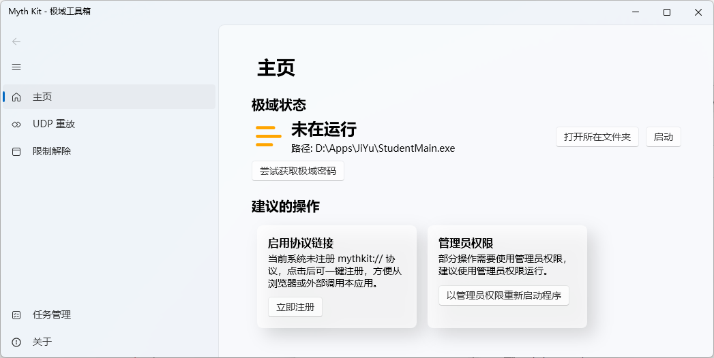
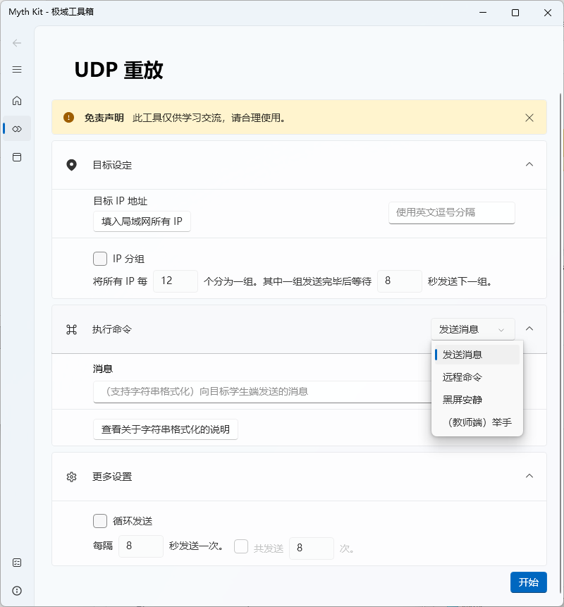
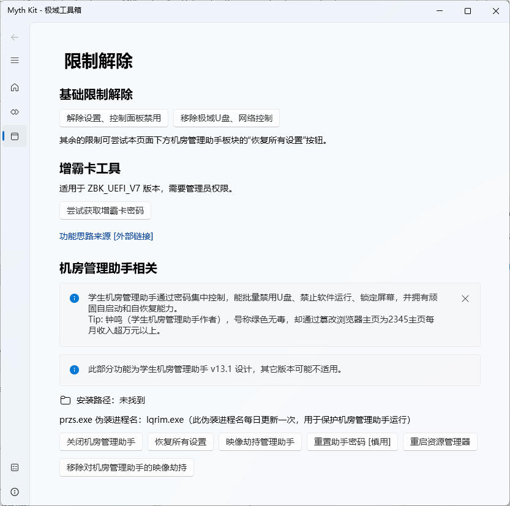
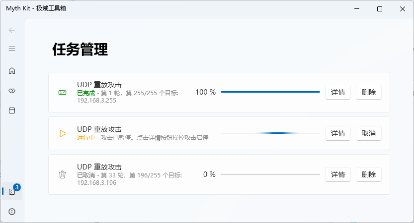
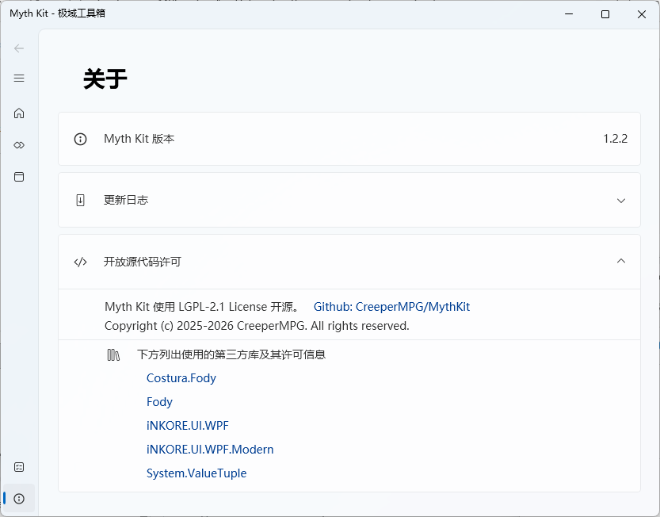

# MythKit


## 软件概述

MythKit 是一款基于 **WPF 和 .NET Framework** 构建的 Windows 极域管理器，使用 `iNKORE.UI.WPF.Modern` 库呈现 Fluent Design 界面。该工具主要用于管理与极域电子教室（Mythware）相关的任务和操作。

> ⚠️ **免责声明**：本软件仅供学习交流使用。使用者应确保其使用行为符合适用的法律、法规、组织政策以及相关软件和网络环境的授权要求。项目作者不对因使用本软件造成的直接或间接损失承担责任。


## 环境要求

| 项目                       | 要求                                   |
| -------------------------- | -------------------------------------- |
| **操作系统**               | Windows 10 / 11（推荐）                |
| **运行时**                 | .NET Framework 4.7.2                   |
| **管理员权限**             | 部分功能需要以管理员身份运行           |
| **开发环境**（自行编译时） | Visual Studio（支持 WPF 开发工作负载） |


## 获取与安装

### 方式一：使用预编译版本（推荐普通用户）

1. 访问仓库的 [Releases 页面](https://github.com/CreeperMPG/MythKit/releases)；
2. 下载最新版本；
3. 解压后直接运行可执行文件；
4. **建议右键选择“以管理员身份运行”**，以确保功能完整。

### 方式二：从源码编译（开发者）

```bash
git clone https://github.com/CreeperMPG/MythKit.git
```

使用 Visual Studio 打开 `MythKit.sln`，还原 NuGet 包后直接生成解决方案。


## 界面与功能模块

MythKit 的主界面采用 Fluent Design 风格，左侧为导航栏，右侧为内容区域。主要功能模块包括以下五个部分：

### 主页

启动后进入主页，显示当前极域的状态信息（运行状态、PID、版本号等）和建议的操作（管理员运行、URI注册等），可以获取极域密码。

### 任务管理

任务管理，负责任务的创建、启动、取消和进度跟踪。任务列表在页面实时显示，支持不确定进度任务和可取消任务。

### UDP 重放攻击

该模块支持通过 **URI Scheme**（`mythkit://`）被外部调用，并触发攻击相关操作。

- **支持的调用格式**：`mythkit://attack/recommend?target=<IP>&type=<类型>&params=<参数>`
- 外部应用可借此向 MythKit 传递攻击目标、类型和参数，随后弹出确认对话框由用户决定是否执行。
- 该模块在 `LITE` 编译版本中会被禁用。

### 限制解除

该模块包含与极域限制、机房管理助手限制解除相关的功能，以及 **增霸卡密码获取** 功能。


## 使用指南

> 若功能使用过程中出现错误，请检查是否以管理员权限运行程序

### 启动程序

1. 右键点击 MythKit 可执行文件，选择 **“以管理员身份运行”**；
2. 程序启动后自动进入主页。

### 查看极域状态

主页会显示极域当前的状态，包括：
- 是否正在运行
- 进程 PID
- 极域目录

### 使用重放攻击

1. 输入攻击目标 IP。也可以使用“获取局域网所有 IP”按钮遍历网段 IP；
2. 选择攻击类型并填写参数，部分攻击类型需要添加频道，可前往极域设置查看；部分输入框支持字符串格式化；
3. 可设置 IP 分组、重复发送选项；
4. 点击“开始”按钮，攻击将自动在后台运行，可在任务管理页面中查看。

### 管理任务

1. 在任务管理界面查看已创建的任务列表；
2. 点击任务可查看详情和进度；
3. 支持启动、取消任务操作。

### 通过 URI Scheme 调用攻击模块（高级）

在浏览器或命令行中执行：

```
mythkit://attack/recommend?target=192.168.1.100&type=black_screen&params=...
```

程序会弹出确认对话框，确认后执行相应操作。此功能需在非 `LITE` 版本中使用。

### 获取极域/增霸卡密码

在“主页/限制解除”页面中，使用密码获取功能读取极域/增霸卡相关密码信息。操作可能需要管理员权限。


## 重要注意事项

1. **法律与授权**：本软件仅供学习交流，使用者须确保行为符合法律法规及组织政策。
2. **管理员权限**：多数功能依赖对系统进程、服务和注册表的操作，**必须以管理员权限运行**，否则部分功能会失效。
3. **杀毒软件误报**：由于涉及进程操作和网络攻击模拟，可执行文件可能被安全软件标记，需自行判断并添加信任。
4. **`LITE` 版本限制**：项目存在 `LITE` 编译条件，该版本会禁用 `UDPAttack` 等模块。若下载的是 LITE 版，部分功能将不可用。


## 开发者信息

- **技术栈**：WPF + .NET Framework + iNKORE.UI.WPF.Modern
- **项目结构**：
  - `Mythware/` — 极域交互核心逻辑
  - `Pages/` — 各功能页面（Home、UDPAttack、RestrictionsRemoving 等）
  - `Tasks/` — 任务管理框架
  - `Utils/` — 工具类和转换器
- **编译条件**：支持 `LITE` 条件编译

## 截图











## 鸣谢

- iNKORE Studios：提供 Fluent Design UI 设计
- liveless：提供 ZBK 密码获取逻辑 [Link](https://www.luogu.com.cn/article/bzu60i4t)
- JiYuTrainer：极域加密密码解密逻辑 [Repo](https://github.com/imengyu/JiYuTrainer) [解密逻辑](https://github.com/imengyu/JiYuTrainer/blob/350c7ee7e5e327a069ef1e4c6d622206797d2c71/JiYuTrainer/TrainerWorker.cpp#L1145)
- [Mist_山岚](https://space.bilibili.com/3546769539467394)：测试应用
